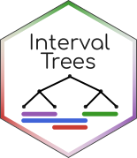

<h1> IntervalTrees</h1>

[](https://github.com/BioJulia/IntervalTrees.jl/releases/latest)
[](https://doi.org/10.5281/zenodo.7825872)
[](https://github.com/BioJulia/IntervalTrees.jl/blob/master/LICENSE)
[](https://biojulia.github.io/IntervalTrees.jl/stable)


## Description

IntervalTrees provides the type: `IntervalTree{K, V}`.
It implements an associative container mapping `(K, K)` pairs to to values of type `V`.
`K` may be any ordered type, but only pairs `(a, b)` where `a ≤ b` can be stored.
In other words they are associative contains that map intervals to values.


## Installation

You can install the IntervalTrees package from the [Julia REPL](https://docs.julialang.org/en/v1/manual/getting-started/).
Press `]` to enter [pkg mode](https://docs.julialang.org/en/v1/stdlib/Pkg/), then enter the following command:
```julia
add IntervalTrees
```

If you are interested in the cutting edge of the development, please check out the [master branch](https://github.com/BioJulia/IntervalTrees.jl/tree/master) to try new features before release.

## Testing

IntervalTrees is tested against Julia `0.7-1.X` on Linux, OS X, and Windows.

**Latest build status:**

[](https://github.com/BioJulia/IntervalTrees.jl/actions?query=workflow%3A%22Unit+tests%22+branch%3Amaster)
[](https://github.com/BioJulia/IntervalTrees.jl/actions?query=workflow%3ADocumentation+branch%3Amaster)
[](https://codecov.io/gh/BioJulia/IntervalTrees.jl)


## Contributing

We appreciate [contributions](https://github.com/BioJulia/IntervalTrees.jl/graphs/contributors) from users including reporting bugs, fixing issues, improving performance and adding new features.

Take a look at the [contributing files](https://github.com/BioJulia/Contributing) detailed contributor and maintainer guidelines, and code of conduct.


### Financial contributions

We also welcome financial contributions in full transparency on our
[open collective](https://opencollective.com/biojulia).
Anyone can file an expense. If the expense makes sense for the development
of the community, it will be "merged" in the ledger of our open collective by
the core contributors and the person who filed the expense will be reimbursed.


# Backers & Sponsors

Thank you to all our backers and sponsors!

Love our work and community? [Become a backer](https://opencollective.com/biojulia#backer).

[](https://opencollective.com/biojulia#backers)

Does your company use BioJulia? Help keep BioJulia feature rich and healthy by
[sponsoring the project](https://opencollective.com/biojulia#sponsor)
Your logo will show up here with a link to your website.

[](https://opencollective.com/biojulia/sponsor/0/website)
[](https://opencollective.com/biojulia/sponsor/1/website)
[](https://opencollective.com/biojulia/sponsor/2/website)
[](https://opencollective.com/biojulia/sponsor/3/website)
[](https://opencollective.com/biojulia/sponsor/4/website)
[](https://opencollective.com/biojulia/sponsor/5/website)
[](https://opencollective.com/biojulia/sponsor/6/website)
[](https://opencollective.com/biojulia/sponsor/7/website)
[](https://opencollective.com/biojulia/sponsor/8/website)
[](https://opencollective.com/biojulia/sponsor/9/website)


## Questions?

If you have a question about contributing or using BioJulia software, come on over and chat to us on [the Julia Slack workspace](https://julialang.org/slack/), or you can try the [Bio category of the Julia discourse site](https://discourse.julialang.org/c/domain/bio).
